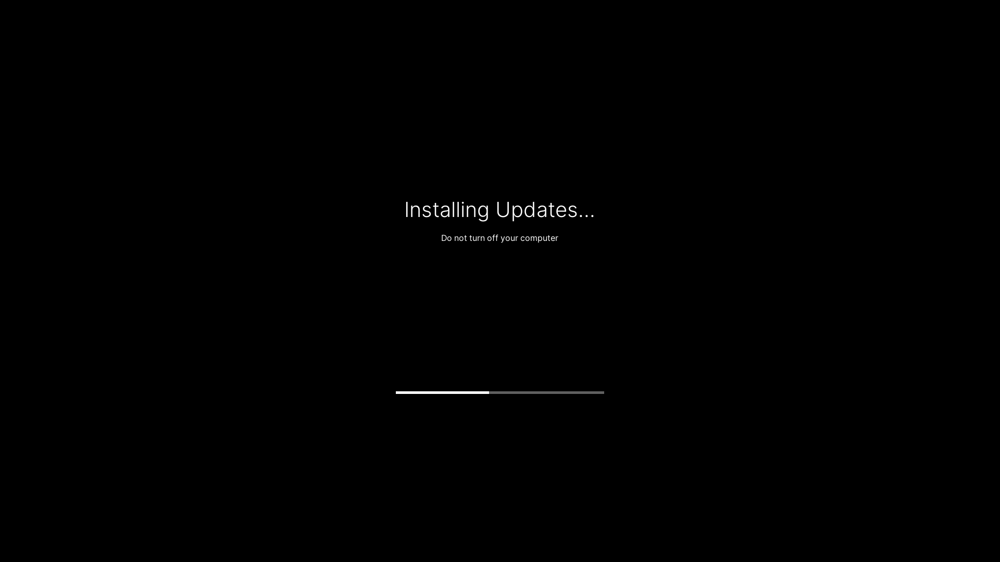
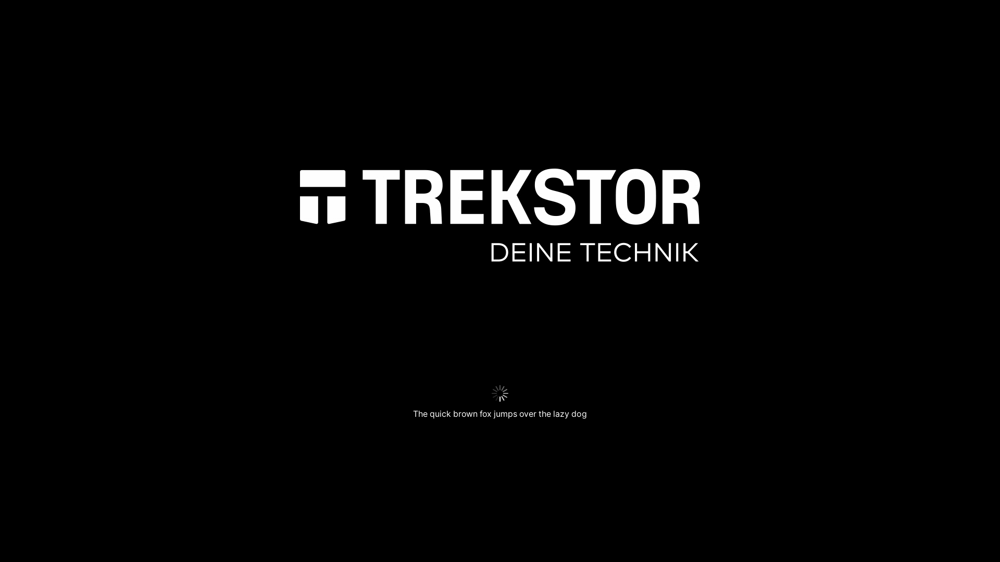
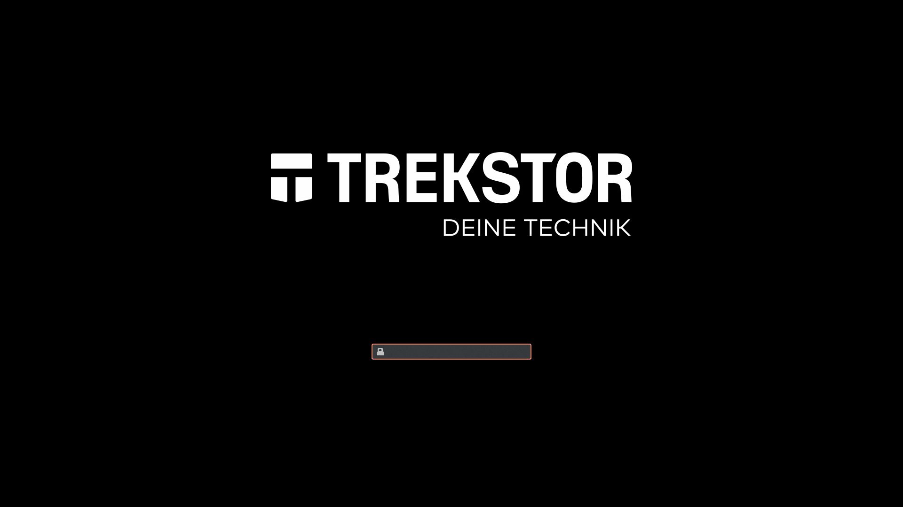

# Plymouth Theme

Pop!_OS Plymouth theme using the ACPI BGRT graphics as background

## Building and installing

You'll need the following dependencies:
* plymouth
* plymouth-theme-spinner

Verify that this theme is set as default:

```bash
$ sudo update-alternatives --config default.plymouth
There are 2 choices for the alternative default.plymouth (providing /usr/share/plymouth/themes/default.plymouth).

  Selection    Path                                                       Priority   Status
------------------------------------------------------------
  0            /usr/share/plymouth/themes/bgrt/bgrt.plymouth               110       auto mode
  1            /usr/share/plymouth/themes/bgrt/bgrt.plymouth               110       manual mode
* 2            /usr/share/plymouth/themes/pop-basic/pop-basic.plymouth   100       manual mode
```

Copy the latest theme

```bash
sudo cp -r pop-basic/* /usr/share/plymouth/themes/pop-basic/
```

and build a new initramfs to apply the changes

```bash
sudo update-initramfs -u -k all
```

If you want to test this is theme in your running X11 session, you'll need the following dependencies:
* plymouth-x11

## Testing

⚠️ Plymouth draws over your desktop. Please note that you will need Terminal 2 on a different workspace to close Plymouth. ⚠️

### Terminal 1

#### Tab 1

Start Plymouth daemon

```bash
sudo plymouthd --no-daemon --debug
```

#### Tab 2

Show splash

```bash
sudo plymouth show-splash
```

### Terminal 2

With this terminal you can test the following modes and user interactions.
When you're done, you can close Plymouth

```bash
sudo plymouth quit
```

### Modes

#### Boot up

<details><summary><code>sudo plymouth change-mode --boot-up</code></summary>


</details>

#### Shutdown

<details><summary><code>sudo plymouth change-mode --shutdown</code></summary>


</details>

#### Reboot

<details><summary><code>sudo plymouth change-mode --reboot</code></summary>


</details>

#### Updates

<details><summary><code>sudo plymouth change-mode --updates</code></summary>



</details>

#### Firmware upgrade

<details><summary><code>sudo plymouth change-mode --firmware-upgrade</code></summary>


</details>

#### System upgrade

<details><summary><code>sudo plymouth change-mode --system-upgrade</code></summary>


</details>

### User interaction

#### Message

<details><summary><code>sudo plymouth message --text="The quick brown fox jumps over the lazy dog"</code></summary>



</details>

#### Password prompt

<details><summary><code>sudo plymouth --ask-for-password</code></summary>



</details>
